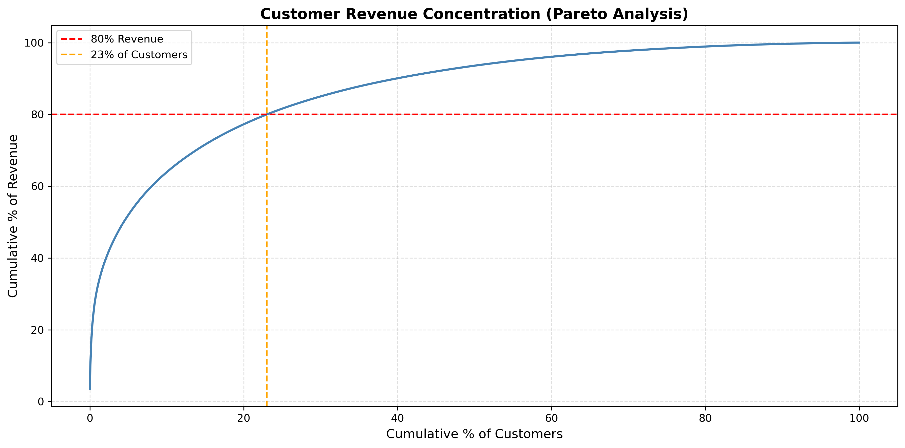
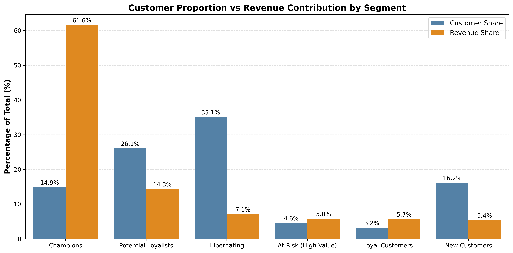
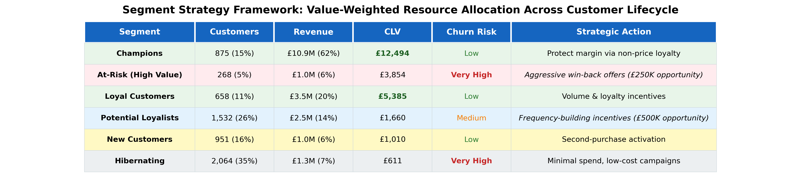

# Customer Value & Revenue Analysis: RFM Segmentation and CLV-Driven Pricing Strategy

## Table of Contents
- [Project Background](#project-background)
- [Business Objective](#business-objective)
- [Data Overview](#data-overview)
- [Analytical Approach](#analytical-approach)
- [Executive Summary of Results](#executive-summary-of-results)
    - [Key Findings](#key-findings)
    - [Business Impact](#business-impact)
- [Detailed Analysis & Insights](#detailed-analysis--insights)
    - [Revenue Concentration Analysis](#revenue-concentration-analysis)
    - [Customer Segmentation (RFM Analysis)](#customer-segmentation-(rfm-analysis))
    - [Customer Lifetime Value Estimation](#customer-lifetime-value-estimation)
    - [Pricing Strategy Framework](#pricing-strategy-framework)
- [Strategic Recommendations](#strategic-recommendations)
- [Implementation Roadmap](#implementation-roadmap)
- [Assumptions & Limitations](#assumptions--limitations)
- [Future Work](#future-work)
- [Technologies Used](#technologies-used)

## Project Background
In e-commerce and online retail, sustainable growth depends not only on sales volume but on understanding which customers drive the most value, how their behavior evolves over time, and which strategies maximize long-term revenue while maintaining healthy unit economics.

This project analyzes **1.06M+ transactions** from a UK-based online gift retailer (2009-2011) to build an end-to-end customer analytics framework that identifies **£1.45M in revenue preservation and growth opportunities** through segment-specific pricing and retention strategies. The analysis demonstrates how to shift resource allocation from volume-driven to value-weighted approaches using data-driven customer segmentation and lifetime value modeling.

All code, methodology, and detailed analysis can be found in the Jupyter notebook: [GitHub Repository Link](https://github.com/ChisomChioke/Customer-Value-Revenue-Optimization-in-Online-Retail/blob/main/Customer_Value_%26_Revenue_Optimization.ipynb). A one-page summary is contained in this document: [1-page Summary](https://drive.google.com/file/d/1wCHCl68QhohyY__U6K_cSh8gBmKT_qJF/view)

## Business Objective
Most customer engagement strategies apply uniform pricing, discounts, and retention spending across the entire customer base, ignoring that customer value is highly concentrated and unevenly exposed to churn risk. This misallocates resources by over-investing in low-value segments while under-protecting high-value customers, ultimately eroding both margin and long-term profitability.

**This project addresses three critical business questions:**

1. **Value Identification:** Which customers generate disproportionate value, and how is that value created (frequency vs. spend)?

2. **Churn Risk Assessment:** Which high-value customers face the greatest attrition risk, and what is the revenue exposure?

3. **Resource Allocation:** How should pricing, discounts, and retention investments be differentiated by customer segment to maximize ROI?

The analysis constructs a framework linking **segmentation → lifetime value → pricing strategy**, enabling efficient allocation of retention spend and pricing flexibility aligned with customer behavior rather than arbitrary rules.

## Data Overview

**Dataset:** [Online Retail II dataset](https://archive.ics.uci.edu/dataset/502/online+retail+ii) from UCI Machine Learning Repository

**Coverage:** 1,067,371 transaction records | December 2009 - December 2011 | 41 countries

**After cleaning:** 805,549 valid transactions from 5,942 unique customers

**Data Preparation:**

- Removed 23% of transactions missing Customer IDs (non-registered purchases)
- Filtered cancellations and returns (negative quantities/prices)
- Aggregated line-items to customer-transaction level
- Created RFM metrics for segmentation

## Analytical Approach

The analysis follows a structured four-phase methodology:

### Phase 1: Exploratory Analysis

- Revenue distribution and concentration patterns (Pareto analysis)
- Customer-level metrics: total revenue, order frequency, average order value
- Temporal patterns and purchasing behavior

### Phase 2: RFM Segmentation

- **Recency:** Days since last purchase (proxy for churn risk)
- **Frequency:** Total number of orders (engagement level)
- **Monetary:** Total revenue generated (historical value)
- Created 6 behavioral segments: Champions, Potential Loyalists, Loyal Customers, At-Risk (High Value), New Customers, Hibernating

### Phase 3: Customer Lifetime Value (CLV) Estimation

- Constructed behavioral CLV proxy using frequency, AOV, and recency-adjusted retention
- Segment-level CLV aggregation to identify value concentration
- Churn exposure assessment (90-day inactivity threshold)

### Phase 4: Pricing Strategy Design

- Segment-specific pricing recommendations aligned with CLV and churn risk
- ROI framework comparing retention vs. acquisition efficiency
- Quantified revenue opportunities by strategic intervention

## Executive Summary of Results

### Key Findings

**1. Extreme Revenue Concentration**

- **15% of customers (Champions) generate 62% of revenue (£10.9M)**
- Top 20% of customers drive 77% of total revenue
- Bottom 50% contribute only 6% of revenue

_Figure 1: Pareto analysis reveals that 23% of customers generate 80% of revenue, validating the need for targeted, value-weighted retention strategies._

**2. Revenue Share vs. Customer Count Imbalance**

Champions represent just 15% of the customer base but drive 62% of total revenue, while Hibernating customers account for 35% of customers but contribute only 7% of revenue—a 5:1 customer-to-value mismatch that would be invisible with uniform engagement strategies.

_Figure 2: Customer proportion vs. revenue contribution reveals extreme imbalance. Treating all customers equally would massively misallocate resources._

**3. Customer Lifetime Value Varies 20x Across Segments**

Champions demonstrate 20x higher CLV (£12,494) than Hibernating customers (£611) through:

- **Frequency advantage:** 22 orders vs. 1.7 orders (13x difference)
- **Spending power:** £459 average order value
- **Strong recency:** 18 days vs. 440 days inactive

Similar total revenue can arise from fundamentally different behaviors—high frequency with moderate AOV vs. infrequent high-value purchases—requiring differentiated pricing strategies.

**4. CLV-Risk Asymmetry: At-Risk Segment Represents Concentrated Revenue Exposure**

- **At-Risk (High Value):** 5% of customers, £1.0M revenue (6%), **100% churn exposure** (338 days avg inactivity)
- Losing this segment would cost **3.8x more** than the revenue generated by acquiring equivalent new customers
- Reactivating just one **At-Risk customer (£3,854 avg value)** preserves the same revenue as acquiring **3.8 new customers (£1,010 each)**

_Figure 3: Segment strategy framework showing customer count, revenue contribution, CLV, churn risk, and recommended strategic actions. Resource allocation must be value-weighted, not volume-driven._

## Business Impact

The analysis identifies **£1.45M+ in combined revenue preservation and incremental growth opportunities** through value-weighted retention and segment-specific pricing strategies:

| **Initiative**             | **Segment**          | **Opportunity** | **Rationale** |
| ----------------------     | -------------------  | --------------- | ------------- |
| **Win-back campaigns**     | At-Risk (High Value) | **£250K**       | 30% reactivation rate on £1.0M At-Risk revenue |
| **Margin protection**      | Champions            | **£545K**       | 5% margin improvement via non-price loyalty (e.g., VIP perks, early access) |
| **Frequency conversion**   | Potiential Loyalists | **£500K**       | 20% frequency lift through targeted incentives |
| **Volume growth**          | Loyal Customers      | **£150K**       | Basket size and repurchase optimization |
| **Activation**             | New Customers        | TBD             | Second-purchase conversion to establish habits |
| **Cost optimization**      | Hibernating          | Minimal         | Low CLV (£611) makes aggressive spend unjustified |

**ROI Framework:** Reactivating **one At-Risk customer (£3,854 avg value)** preserves **3.8x more revenue** than acquiring one new customer (£1,010), demonstrating superior efficiency of value-targeted retention over volume-based acquisition.

## Strategic Recommendations

Based on the analysis, we recommend the following prioritized interventions:

### Priority 1: At-Risk (High Value) Win-Back Campaign

**Objective:** Prevent churn among 268 high-value customers representing £1.0M revenue (6% of total) with 100% churn exposure.

**Actions:**

- Deploy personalized, time-sensitive win-back offers (e.g., "We miss you—20% off your next order, valid for 14 days")
- Direct outreach to top 50 At-Risk customers via email/phone
- A/B test discount depth (15% vs. 20% vs. 25%) to optimize response rate vs. margin impact

**Expected Impact:** 30% reactivation rate = **£250K net revenue recovery**
**ROI Rationale:** Reactivating one At-Risk customer (£3,854 avg value) preserves 3.8x more revenue than acquiring one new customer (£1,010), demonstrating superior efficiency of value-targeted retention over volume-based acquisition.

---

### Priority 2: Champions Margin Protection Program

**Objective:** Protect profitability among 875 Champions generating £10.9M (62% of revenue) by replacing price-based promotions with non-monetary loyalty mechanisms.

**Actions:**

- Audit current discount exposure for Champions segment
- Replace price discounts with VIP benefits: early access to new products, exclusive events, priority customer service
- Implement tiered recognition program (e.g., Champion, Platinum Champion)

**Expected Impact:** 5% margin improvement = **£545K additional profit** (assumes 10% baseline margin; illustrative)
**Risk Mitigation:** Champions show minimal churn risk (18 days recency), making discounts unnecessary and margin-eroding. Non-price perks strengthen loyalty without sacrificing profitability.

---

### Priority 3: Potential Loyalists Frequency Conversion

**Objective:** Convert 1,532 moderately engaged customers (4.4 orders avg, 82 days recency) into higher-frequency purchasers.

**Actions:**

- Deploy frequency-building incentives: "Buy 3 times this month, get 15% off your next order"
- Personalized product recommendations based on purchase history
- Graduated loyalty tiers to gamify engagement

**Expected Impact:** 20% frequency lift = **£500K incremental revenue**
**Strategic Value:** Potential Loyalists represent the largest segment (26% of customers) with proven purchasing behavior and clear upside. Converting even 20% into Loyal/Champions significantly improves portfolio mix.

---

### Priority 4: Loyal Customers Volume Growth

**Objective:*** Maintain engagement and grow basket size among 658 Loyal Customers contributing £3.5M (20% of revenue).

**Actions:**

- Volume-based incentives: threshold rewards ("Spend £X, save Y"), bundle offers
- Subscription programs for repeat-purchase items (auto-replenishment)
- Loyalty milestones with escalating rewards

**Expected Impact:** 15% revenue lift = **£150K incremental revenue**
**Risk Monitoring:** 48% of Loyal Customers show moderate churn risk (98 days recency). Proactive engagement prevents migration to At-Risk segment.

---

### Priority 5: New Customer Activation

**Objective:** Establish purchasing habits among 951 New Customers before they churn or become price-sensitive.

**Actions:**

- Automated post-purchase engagement sequences (thank you email, product care tips, complementary product suggestions)
- Moderate second-purchase incentive (e.g., 10% off next order within 30 days)
- Avoid aggressive discounting that trains price sensitivity

**Expected Impact:** 25% improvement in second-purchase activation rate = long-term CLV uplift (quantification requires cohort tracking)

---

### Priority 6: Hibernating Segment Cost Optimization

**Objective:** Minimize resources allocated to 2,064 Hibernating customers (35% of base) contributing only £1.3M (7% of revenue) with £611 average CLV.

**Actions:**
- Limit to broad, low-cost email campaigns (quarterly newsletters, seasonal promotions)
- Allow natural attrition
- Reallocate marketing budget to Priorities 1-4 (higher-ROI segments)

**Expected Impact:** <£100K recovery potential; primary value is **resource reallocation** to segments with 5-10x better ROI

## Implementation Considerations

### Technical Requirements:

- Automated monthly RFM segmentation with churn alerts for customers exceeding 90-day inactivity
- Campaign attribution tracking to measure revenue recovery by intervention
- A/B testing infrastructure for segment-specific pricing strategies
- CLV monitoring dashboards tracking realized vs. predicted lifetime value

## Implementation Phases:

### Phase 1: Foundation & Quick Wins

- Implement monthly RFM segmentation automation (SQL/Python scripts integrated with CRM)
- Launch At-Risk win-back campaign (Priority 1)
- Audit Champions discount exposure and begin margin protection rollout (Priority 2)

### Phase 2: Expansion & Testing

- Deploy Potential Loyalists frequency conversion program (Priority 3)
- Implement A/B testing infrastructure for segment-specific pricing strategies
- Launch Loyal Customers volume growth initiatives (Priority 4)

### Phase 3: Optimization & Scaling

- Refine pricing strategies based on A/B test results
- Develop predictive survival model for forward-looking CLV (replace historical proxy)
- Launch New Customer activation sequences (Priority 5)
- Implement CLV monitoring dashboards tracking realized vs. predicted lifetime value

## Assumptions & Limitations

### Key Limitations:

**1. Historical CLV proxy rather than predictive model:** CLV calculated using behavioral proxy (frequency × AOV × recency-adjusted retention) rather than survival-based probabilistic model. Future value may be over/understated for individual customers.

**2. No experimental price variation:** Pricing strategy recommendations based on behavioral inference, not A/B testing. Elasticity and discount responsiveness should be validated through controlled experiments before full deployment.

**3. No cost/margin data:** Profit optimization estimates (e.g., £545K Champions margin improvement) are directional and assume illustrative margins (10% baseline). Actual profitability depends on true unit economics.

**4. Static 90-day churn threshold:** Churn definition may vary by product category, seasonality, or customer segment. More sophisticated approach would calibrate segment-specific thresholds.

**5. Time period (2009-2011):** E-commerce dynamics may have changed significantly since 2011 (mobile commerce, social shopping, subscriptions). Validation with recent data recommended before major strategy shifts.

**6. No cross-segment migration modeling:** Analysis assumes static segmentation but customers migrate between segments over time. Cohort retention analysis would provide insight into engagement decay patterns.

## Future Work

The following enhancements would strengthen the analytical framework:

Predictive CLV Modeling: Replace behavioral proxy with survival-based CLV models (e.g., Beta-Geometric/NBD) for probabilistic churn predictions and time-to-event forecasts
A/B Testing Infrastructure: Implement controlled experiments to measure causal effects of pricing and retention tactics by segment
Margin-Adjusted Optimization: Incorporate product-level margin data to optimize profit rather than revenue
Cohort Retention Analysis: Model engagement decay patterns to identify early warning signals for segment migration (e.g., Loyal → At-Risk)
Product Affinity & Bundling: Analyze cross-purchase patterns to inform personalized recommendations and category-level CLV drivers
Real-Time Segmentation: Build streaming pipeline to enable immediate personalization (e.g., real-time next-best-offer during checkout)

Technologies Used

Python — Data processing, analysis, and modeling

Pandas / NumPy — Data manipulation and aggregation
Matplotlib / Seaborn — Visualization and exploratory analysis
Scikit-learn — RFM quantile binning and segmentation logic

Jupyter Notebook — End-to-end reproducible analysis and documentation
SQL — Data extraction and transformation (production deployment)
